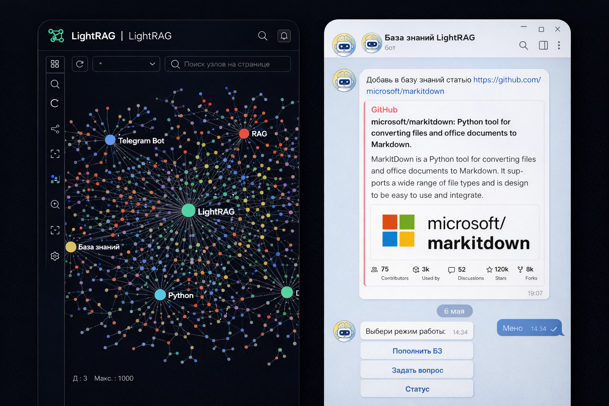

# LightRAG + Telegram Bot


<!-- MOCKUPS:START -->

<!-- MOCKUPS:END -->

Готовое решение для **личной или корпоративной базы знаний**: документы и ссылки попадают в [LightRAG](https://github.com/HKUDS/LightRAG), ответы и пополнение — через Telegram.

**Для кого:** технические фаундеры, тимлиды, консультанты — нужен единый «инбокс знаний» и Q&A поверх своих материалов, с прозрачной логикой (RAG → веб → модель), а не чёрный ящик.

---

## Что внутри

| Компонент | Роль |
|-----------|------|
| **LightRAG** | Хранение, граф знаний, retrieval по режимам `mix` / `hybrid` / `global` / `local` / `naive` |
| **Telegram-бот** (`telegram_bot/`) | Ingest, Q&A, статус, перевод, контекст диалога, веб-дополнение |
| **PostgreSQL** | Бэкенд LightRAG на VPS (через docker compose) |
| **OpenAI API** | Judge полноты ответа, синтез с вебом, fallback вне RAG, технический перевод |
| **Tavily** | Веб-поиск при неполном ответе из БЗ (опционально) |

---

## Архитектура (кратко)

```text
Telegram
   │
   ▼
telegram-bot (aiogram 3, FSM)
   ├─ Ingest: текст / файл / URL → LightRAG API
   └─ Q&A:
        0) Deep Q&A (опционально): LLM-план → 3+ подзапроса в LightRAG → синтез из БЗ
        1) LightRAG (цепочка режимов) — если deep выкл или упал
        2) LLM-judge: нужен ли веб?
        3) Tavily Search + синтез ответа + References
        4) OpenAI fallback (если всё ещё «слабый» ответ; для deep/resume часто блокируется)
        5) опционально перевод на RU
```

---

## Пополнение базы знаний (режим «Пополнить БЗ»)

Бот — **инбокс для знаний**. Всё уходит в LightRAG через API.

### Текст
- Лимит размера сообщения.
- При `BOT_TRANSLATE_TO_RU=true` — **технический перевод на русский** (код, CLI, API-имена не ломаются).
- `POST /documents/text` + трекинг `track_id`.
- Уведомления: «в очереди» → прогресс → «обработан» / «с ошибками» (`/documents/track_status/{id}`).

### Файлы
- Текстовые форматы: извлечение текста → при необходимости перевод → ingest как текст.
- PDF/DOCX и др.: `/documents/upload` (fallback `/documents/file`).
- Лимит размера файла, понятные ошибки пользователю.

### Ссылки (URL)
- Только публичные HTTP(S); **SSRF-защита** (блок localhost, private IP, опасных редиректов).
- Парсинг HTML (BeautifulSoup), извлечение значимого текста.
- **Обход внутренних ссылок того же сайта** (BFS): несколько страниц в один документ (`---` между блоками).
- Лимиты: `BOT_URL_FOLLOW_MAX_PAGES`, `BOT_URL_FOLLOW_DEPTH`, `BOT_URL_FOLLOW_MAX_LINKS`.
- При включённом переводе — технический RU перед ingest.

---

## Q&A (режим «Задать вопрос»)

### Контекст диалога
- История «вопрос — ответ» в RAM процесса бота подмешивается в следующий запрос.
- Уточнения вроде «а это что?» / «раскрой пункт 2» работают без повторения всей предыстории.
- Сброс: `/forgetctx`, `/forget_context`, `/start`.
- TTL простоя: `BOT_QA_SESSION_IDLE_MINUTES` (по умолчанию 20 мин; `0` / `off` — отключить).
- **Важно:** после рестарта контейнера контекст обнуляется (для персистентности позже — Redis/Postgres).

### Цепочка ответа

0. **Deep Q&A** (если `BOT_ENABLE_DEEP_QA=true`, по умолчанию вкл):
   - LLM строит план: тип задачи + **минимум 3 подзапроса** (триада: суть / детали / источники в БЗ);
   - каждый подзапрос — отдельный RAG с fallback;
   - финальный синтез **только из фрагментов БЗ** (без выдуманных фактов);
   - для `resume` / `document` по умолчанию **без веба и без OpenAI вне RAG**.
1. **LightRAG** — одиночный запрос, если deep выключен или упал (стартовый режим `BOT_QUERY_MODE`, fallback: `hybrid` → `global` → `naive`).
2. **Проверка «слабого» ответа** — отказы вроде «не могу предоставить ответ», «недостаточно информации» запускают следующий режим, а не останавливают цепочку на первом шаге.
3. **Веб-поиск** (если `BOT_ENABLE_WEB_SEARCH=true`):
   - LLM оценивает, полон ли ответ из БЗ;
   - при необходимости — запросы в **Tavily**, синтез ответа из RAG + сниппетов;
   - внизу сообщения блок **References** (только реальные URL из поиска).
4. **OpenAI вне RAG** (если `BOT_ENABLE_OPENAI_FALLBACK=true` и ответ всё ещё слабый, **и веб уже не помог**).
5. **Перевод ответа** на русский при `BOT_TRANSLATE_TO_RU=true`.

### Что видит пользователь

```text
Режим поиска: hybrid (проверено: mix,hybrid,global,naive) -> web
Источник ответа: LightRAG + интернет
Режим ответа: оригинал

<текст ответа>

References:
- Заголовок страницы
  https://example.com/page
```

Переопределение режима на чат: `/qmode hybrid`, inline-кнопки или `режим:global | ваш вопрос`.

### Умные переписывания вопросов

Для типовых фраз про «владельца» БЗ бот подставляет запрос к вашим документам (резюме, intro), например:
- «как меня зовут» → поиск ФИО в базе;
- «где я живу» → город из резюме/графа знаний.

---

## Telegram-интерфейс

| Элемент | Действие |
|---------|----------|
| Кнопка **Меню** | Reply-клавиатура, всегда снизу |
| **Пополнить БЗ** | Ingest текст / файл / URL |
| **Задать вопрос** | Q&A с контекстом и fallback |
| **Статус** | Health LightRAG, настройки Q&A, счётчики, аптайм |
| `/start` | Сброс FSM и контекста Q&A |
| `/status` | Обновить экран статуса (или слово «статус» на экране статуса) |
| `/qmode <mode>` | Режим retrieval для чата |
| `/omodel <id>` | Модель OpenAI для Q&A (judge, deep, веб-синтез, fallback); inline-кнопки с ценами |
| `/forgetctx` | Сброс истории Q&A |

После перезапуска бота FSM сбрасывается: текст из меню автоматически уходит в Q&A; надёжнее — `/start` → «Задать вопрос».

**Экран «Статус»:** пока активен `status_mode`, `/status` или «статус» / «обновить» обновляют отчёт; **любой другой текст** трактуется как вопрос и уходит в Q&A (не застревает на статусе).

---

## Экран «Статус»

Показывает:
- активный режим UI (меню / ingest / Q&A / статус);
- аптайм процесса с последнего рестарта;
- LightRAG health и URL;
- настройки Q&A: режимы, fallback, **deep Q&A**, веб, OpenAI fallback, модель OpenAI, перевод, TTL контекста;
- **счётчики на русском** (вопросы, deep Q&A, ingest, веб-поиски, ошибки) — с нуля после каждого рестарта контейнера.

---

## Надёжность и безопасность

### Доступ только для владельца (Telegram ACL)

По умолчанию бот **открыт для всех**, кто знает `@username` и нажал Start. Чтобы ограничить доступ только собой:

```env
BOT_ALLOWED_USER_IDS=123456789
BOT_DENY_GROUP_CHATS=true
BOT_ACCESS_CONTROL_REQUIRED=true
```

На VPS (прод): ACL **включён** — без `BOT_ALLOWED_USER_IDS` или `TELEGRAM_BOT_CHATID` бот не стартует при `BOT_ACCESS_CONTROL_REQUIRED=true`.

- `BOT_ALLOWED_USER_IDS` — твой Telegram **user id** (узнать: [@userinfobot](https://t.me/userinfobot)).
- `TELEGRAM_BOT_CHATID` — тот же id в личке с ботом тоже подойдёт (добавляется в allowlist).
- `BOT_DENY_GROUP_CHATS=true` — отклонять группы/супергруппы (рекомендуется).
- `BOT_ACCESS_CONTROL_REQUIRED=true` — не стартовать бот без настроенного allowlist.
- `BOT_ACCESS_DENIED_MESSAGE` — текст отказа в личке (опционально).

Проверка в **middleware** до всех хендлеров: сообщения, файлы, inline-кнопки, `/start`.

- **Rate limit** per chat (`BOT_RATE_LIMIT_*`).
- **HTTP retries** для query/GET; ingest POST **без** повторов (нет дублей документов).
- Учёт заголовка `Retry-After` при 429.
- Авторизация LightRAG: `X-API-Key`.
- Ошибки пользователю — без внутренних stack trace.
- SSRF-защита URL-ingest.
- Scrub URL в синтезе: модель не может подставить чужие ссылки в References.

---

## Структура репозитория

```text
telegram_bot/
  main.py              # точка входа, polling, ACL startup guard
  handlers.py          # Telegram-хендлеры, Q&A pipeline
  access_control.py    # allowlist user id, deny groups
  deep_qa.py           # multi-RAG: план → подзапросы → синтез из БЗ
  lightrag_client.py   # API LightRAG + OpenAI chat/json
  openai_models.py     # каталог моделей, /omodel
  web_search.py        # Tavily / ddgs
  answer_completeness.py
  web_answer_synthesis.py
  status_report.py
  url_ingest.py        # URL + обход сайта
  translation.py
  qa_context.py
  reliability.py
tests/                 # unit-тесты (pytest)
.agent-remote/         # deploy-telegram-bot.ps1, compose overlays
Documentation/lightrag_guide.md
README.md              # этот файл (копируется на VPS в /opt/LightRAG/)
```

---

## Переменные окружения

### Обязательные

| Переменная | Описание |
|------------|----------|
| `TELEGRAM_BOT_TOKEN` | Токен бота от @BotFather |
| `LIGHTRAG_URL` | URL API, на VPS: `http://lightrag:9621` |
| `LIGHTRAG_API_KEY` | Ключ `X-API-Key` LightRAG |

### LightRAG / OpenAI

| Переменная | По умолчанию | Описание |
|------------|--------------|----------|
| `OPENAI_API_KEY` | — | Judge, синтез, fallback, перевод |
| `BOT_OPENAI_MODEL` | `o4-mini` | Модель OpenAI по умолчанию (Q&A judge/синтез/fallback; каталог обновляется при старте) |
| `OPENAI_API_BASE_URL` | `https://api.openai.com/v1` | Совместимые API |
| `BOT_OPENAI_TIMEOUT_SECONDS` | `45` | Таймаут OpenAI-вызовов |

### Q&A / RAG

| Переменная | По умолчанию | Описание |
|------------|--------------|----------|
| `BOT_QUERY_MODE` | `mix` | Стартовый режим LightRAG |
| `BOT_QUERY_FALLBACK_MODES` | `hybrid,global` | + всегда `naive` в конце |
| `BOT_ENABLE_OPENAI_FALLBACK` | `true` | Модель вне RAG после слабого RAG/веба |
| `BOT_TRANSLATE_TO_RU` | `false` | Перевод ingest и ответов |
| `BOT_QA_SESSION_IDLE_MINUTES` | `20` | TTL контекста Q&A (`0` = выкл) |
| `BOT_QA_CONTEXT_MAX_MESSAGES` | `24` | Лимит реплик в памяти |
| `BOT_QA_CONTEXT_MAX_CHARS` | `7000` | Лимит символов контекста |

### Deep Q&A (multi-RAG)

| Переменная | По умолчанию | Описание |
|------------|--------------|----------|
| `BOT_ENABLE_DEEP_QA` | `true` | Планировщик + несколько RAG-подзапросов + синтез |
| `BOT_DEEP_QA_MIN_SUBQUERIES` | `3` | Минимум подзапросов (триада суть/детали/источники) |
| `BOT_DEEP_QA_MAX_SUBQUERIES` | `8` | Максимум подзапросов |
| `BOT_DEEP_QA_MAX_EVIDENCE_CHARS` | `28000` | Лимит текста evidence для синтеза |
| `BOT_DEEP_QA_SKIP_WEB` | `true` | Не вызывать веб для `resume` / `document` после deep |
| `BOT_DEEP_QA_BLOCK_OPENAI_FALLBACK` | `true` | Не подменять deep-ответ OpenAI вне RAG |

### Веб-поиск (Tavily)

| Переменная | По умолчанию | Описание |
|------------|--------------|----------|
| `BOT_ENABLE_WEB_SEARCH` | `false` | Включить веб в Q&A |
| `TAVILY_API_KEY` | — | Ключ Tavily |
| `BOT_WEB_SEARCH_PROVIDER` | `tavily` | `tavily` или `ddgs` (dev) |
| `BOT_WEB_SEARCH_MAX_QUERIES` | `3` | Запросов на один вопрос |
| `BOT_WEB_SEARCH_MAX_RESULTS` | `5` | Результатов на запрос |
| `BOT_WEB_SEARCH_MAX_TOTAL_RESULTS` | `8` | Итого в синтезе |
| `BOT_WEB_SEARCH_TIMEOUT_SECONDS` | `25` | Таймаут поиска |
| `BOT_TAVILY_SEARCH_DEPTH` | `basic` | Глубина Tavily |
| `BOT_ENABLE_ANSWER_COMPLETENESS_JUDGE` | как web | LLM-judge полноты |
| `BOT_WEB_JUDGE_MIN_CONFIDENCE` | `0.55` | Порог уверенности judge |
| `BOT_WEB_JUDGE_MAX_RAG_CHARS` | `4500` | Обрезка ответа RAG для judge |
| `BOT_WEB_SYNTHESIS_MAX_SNIPPET_CHARS` | `700` | Сниппет на источник |

### URL-ingest

| Переменная | По умолчанию |
|------------|--------------|
| `BOT_URL_FOLLOW_MAX_PAGES` | `6` |
| `BOT_URL_FOLLOW_DEPTH` | `1` |
| `BOT_URL_FOLLOW_MAX_LINKS` | `24` |

### Прочее

| Переменная | По умолчанию |
|------------|--------------|
| `TELEGRAM_BOT_CHATID` | опционально; в личке обычно = твой user id |
| `BOT_ALLOWED_USER_IDS` | whitelist user id через запятую |
| `BOT_DENY_GROUP_CHATS` | `true` — не обслуживать группы |
| `BOT_ACCESS_CONTROL_REQUIRED` | `true` — падать при старте без allowlist |
| `BOT_ACCESS_DENIED_MESSAGE` | текст отказа неавторизованным |
| `BOT_RATE_LIMIT_MAX_EVENTS` | `6` |
| `BOT_RATE_LIMIT_WINDOW_SECONDS` | `30` |
| `BOT_HTTP_RETRY_ATTEMPTS` | `2` |
| `BOT_HTTP_RETRY_BACKOFF` | `0.7` |

Пример фрагмента `.env` на VPS:

```env
TELEGRAM_BOT_TOKEN=...
TELEGRAM_BOT_CHATID=123456789
BOT_ALLOWED_USER_IDS=123456789
BOT_ACCESS_CONTROL_REQUIRED=true
BOT_DENY_GROUP_CHATS=true
LIGHTRAG_URL=http://lightrag:9621
LIGHTRAG_API_KEY=...
OPENAI_API_KEY=...
BOT_ENABLE_DEEP_QA=true
BOT_ENABLE_WEB_SEARCH=true
TAVILY_API_KEY=tvly-...
BOT_ENABLE_OPENAI_FALLBACK=true
BOT_TRANSLATE_TO_RU=true
BOT_QUERY_MODE=mix
```

---

## Локальная разработка

```powershell
python -m venv .venv
.\.venv\Scripts\Activate.ps1
pip install -r requirements.txt
python -m pytest -q
```

Запуск бота локально (нужны `.env` и доступный LightRAG):

```powershell
$env:TELEGRAM_BOT_TOKEN="..."
$env:LIGHTRAG_URL="http://127.0.0.1:9621"
$env:LIGHTRAG_API_KEY="..."
python -m telegram_bot.main
```

---

## Деплой на VPS (Docker)

На сервере: LightRAG + Postgres из основного `docker-compose.yml`, бот — overlay.

```powershell
powershell -ExecutionPolicy Bypass -File ".agent-remote/deploy-telegram-bot.ps1"
```

Скрипт:
- копирует `telegram_bot/` на сервер;
- проверяет `TELEGRAM_BOT_TOKEN` в `/opt/LightRAG/.env`;
- `docker compose ... up -d --build --force-recreate telegram-bot`.

`README.md` на VPS обновляется отдельно (не входит в deploy-скрипт):

```powershell
scp -i C:\Users\User\.ssh\alexklyvibe README.md root@193.168.196.12:/opt/LightRAG/README.md
```

Проверка логов:

```bash
docker logs lightrag-telegram-bot --tail 100 -f
```

---

## Ветки Git

| Ветка | Назначение |
|-------|------------|
| `main` | Продакшен на VPS, всё для деплоя |
| `local-helper` | Локальные эксперименты, IDE, вспомогательное |

Журнал решений и деплоя: `Documentation/lightrag_guide.md`.

---

## Тесты

```powershell
python -m pytest -q
```

Покрытие: ingest, URL/SSRF, fallback RAG, **deep Q&A**, веб-поиск, judge, синтез, контекст Q&A, **ACL**, статус, порядок хендлеров.

---

## Лицензия и ссылки

- LightRAG: [HKUDS/LightRAG](https://github.com/HKUDS/LightRAG)
- Tavily: [tavily.com](https://tavily.com)
- aiogram 3: [документация](https://docs.aiogram.dev/)
